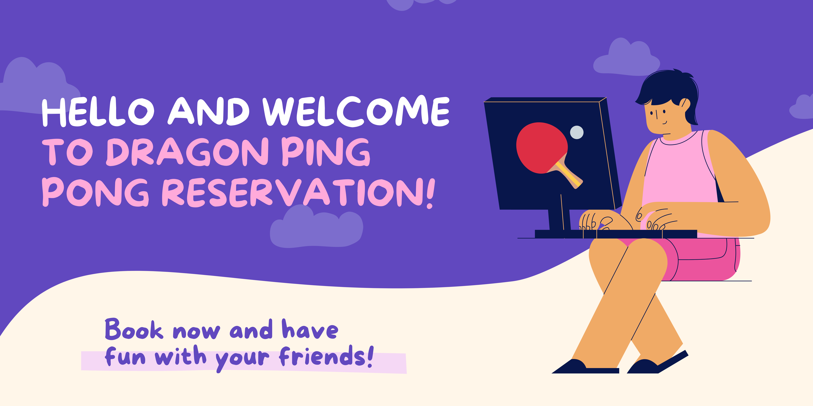
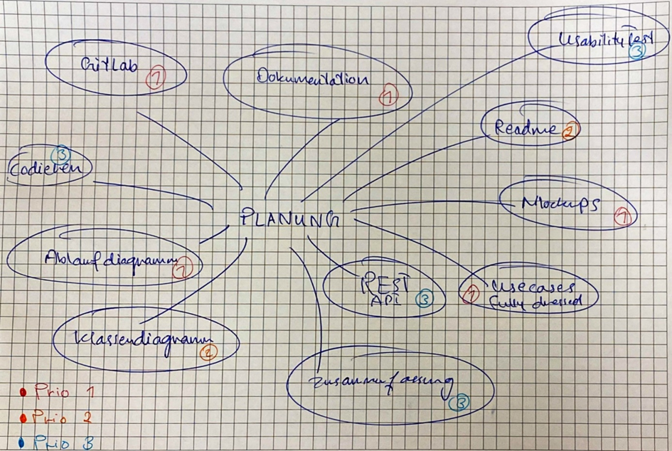
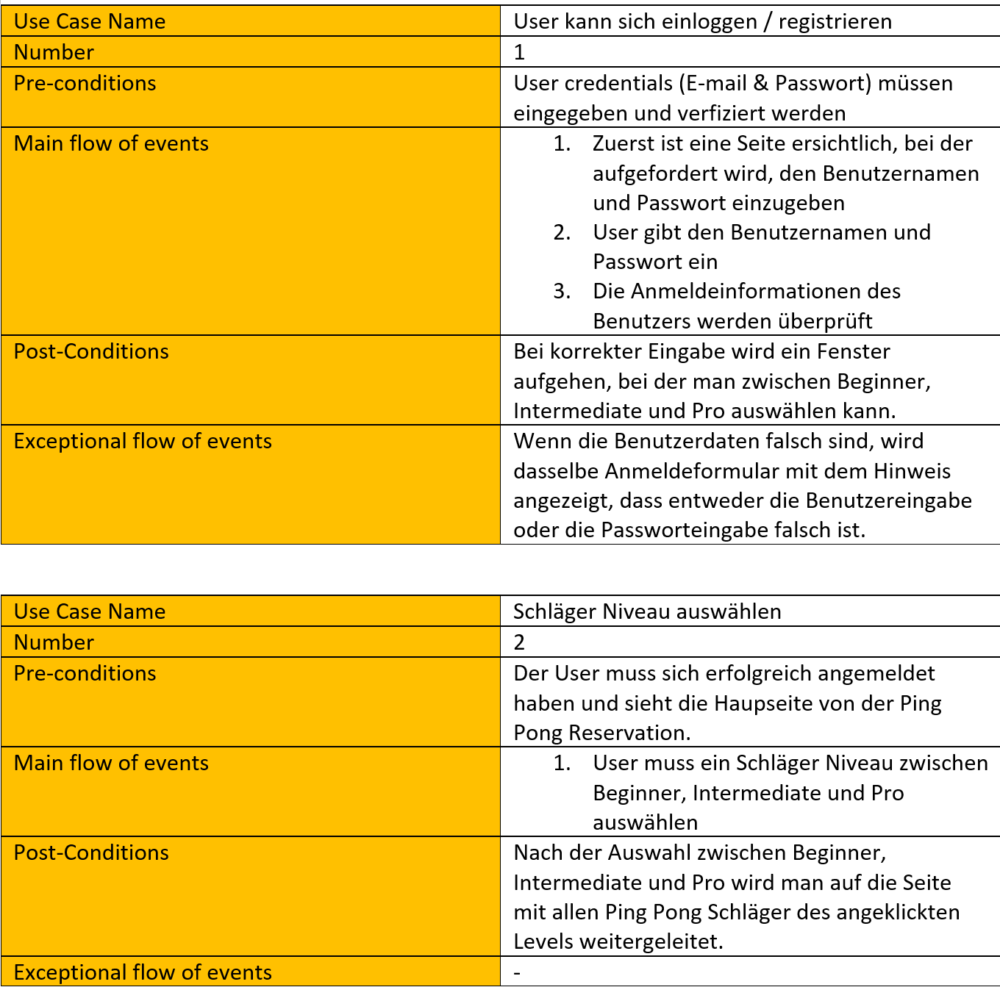
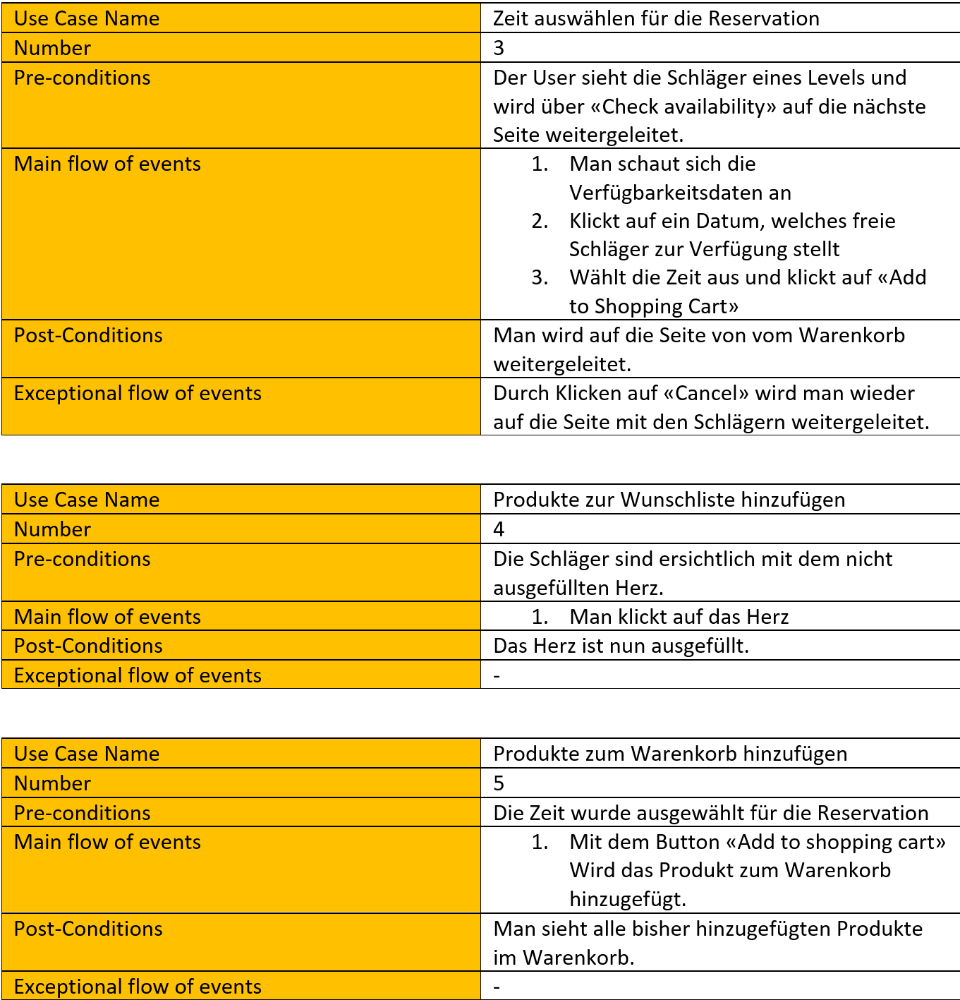
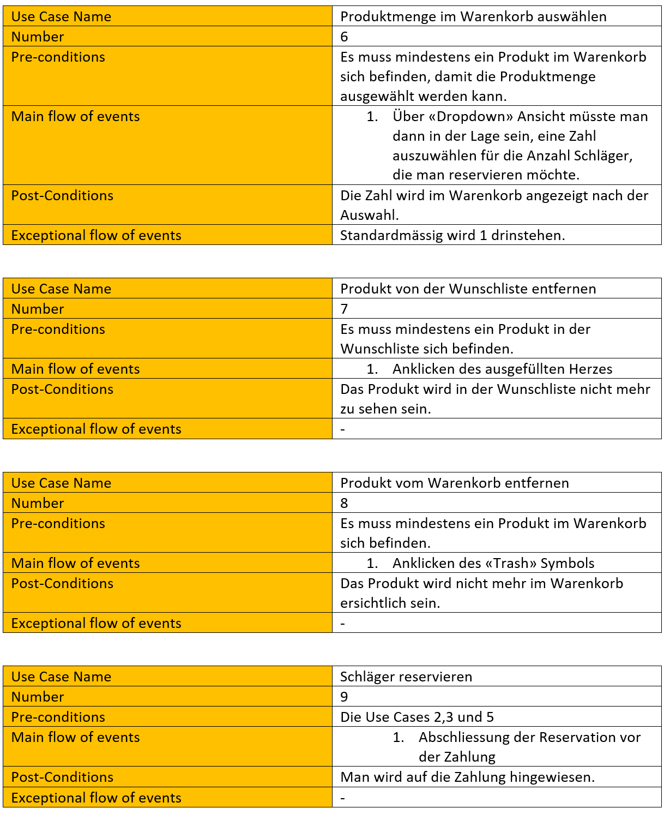
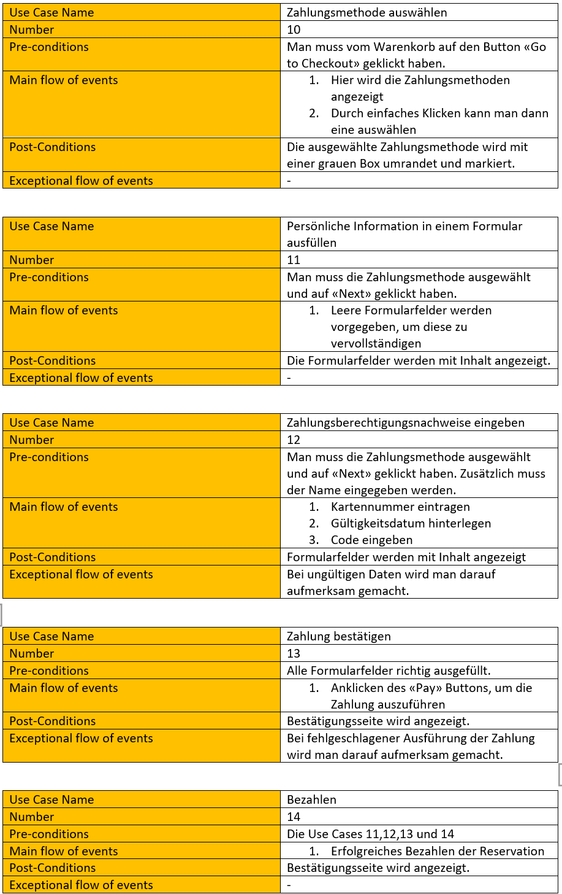
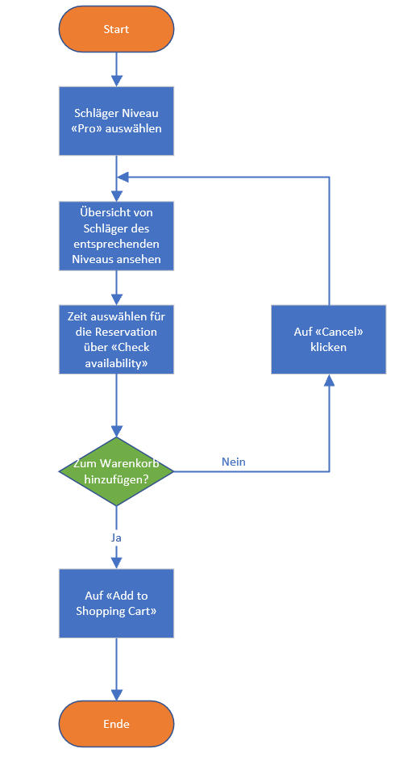

# Ping Pong Schläger-Reservation

# Demovorschau

# Inhalt
1. [Kurzfassung](#kurzfassung)
   1. [Idee](#idee)
   2. [Umsetzung](#umsetzung)
   3. [Ergebnis](#ergebnis)
3. [Use cases](#usecase)
   1. [Fully dressed use cases](#fullyDressedUsecases)
   2. [Use case Diagramm](#useCaseDiagramm)
4. [Diagramm](#Diagramm)
    1. [Klassendiagramm](#klassendiagramm)
    2. [Ablaufdiagramm](#ablaufdiagramm)
5. [Usability-Test](#usability-test)
6. [Wireframe](#wireframe)

## Kurzfassung 
### Idee 
Mit diesem Tool kann sich der Benutzer beim Reservierungstool anmelden oder registrieren und einen oder mehrere Tischtennisschläger reservieren. Das Tool bietet dem Benutzer weitere Funktionen, wie z. B. die Auswahl, welches Niveau, wie viele Schläger, ob mit oder ohne Tischtennisbälle und für wie lange.

### Umsetzung 

#### MindMap
Bei der Umsetzung dieser Idee sind wir so vorgegangen, dass wir zuerst ein MindMap erstellt haben,
welches uns einen Überblick über die verschiedenen umzusetzende Aufgaben verschafft. Danach haben wir diese nach Prioritäten eingeteilt. 

#### Dokumentation
Wir haben unsere Erkenntnisse, Ideen, Bilder und Diagramme zuerst auf Word festgehalten, damit man einfachere Screenshots machen kann, bevor wir diese in Markdown übertragen.

#### Github
Um gemeinsam an einem Projekt zu arbeiten, brauchen wir ein Versionsverwaltungstool. Wir haben uns in diesem Fall für Github entschieden, da wir dieses bis jetzt am besten kennen und haben ein Repository 
mit dem Namen "M120_pingPongReservation" erstellt. Danach haben wir unsere Aufgaben aufgeteilt, sodass jeder von uns individuell am Projekt arbeiten konnte. Es gab jedoch auch Aufgaben, die wir gemeinsam durchgeführt haben aufgrund der Komplexität.

### Ergebnis
Rückblickend auf unser Projekt sind wir zufrieden mit den Ergebnissen. Abgesehen von der Implementation konnten wir alles umsetzen, was wir wollten. Wir haben durch dieses Projekt gelernt, wie wichtig die Designphase ist für die Softwareentwicklung, wie man Wireframes erstellt, wie man Erkenntnisse in Markdown festhält und vieles mehr. 

## Use cases 
### Fully dressed use cases 

### Use case Diagramm 

## Diagramm 

### Klassendiagramm 
#### Vorher:

#### Nachher:

### Ablaufdiagramm 
Bei diesem Ablaufdiagramm haben wir uns für den Use Case "Schläger reservieren" entschieden, da dieser wahrscheinlich der wohl wichtigste Use Case ist bei unserem Projekt. Hierbei wird ein Schläger des Niveaus "Pro" reserviert. 

## Usability-Test 

### Was möchten wir testen?
Wir möchten testen, wie benutzerfreundlich unsere Applikation ist.
Die Applikation ist so entworfen, dass sie einen Tischtennisschläger für eine bestimmte Zeit reservieren können. Nun wollen wir den Usability-Test überprüfen, indem wir zwei verschiedene Szenarien wie folgt durchspielen:

### Das erste Test-Szenario
Das Wetter ist am Samstag sehr schön und Sie möchten Tischtennis-Schläger für einen ganzen Tag reservieren. Da Ihr Niveau Anfänger und das Ihrer Freunde Profi sind, müssen Sie zwei Tischtennis-Schläger reservieren, aber mit zwei verschiedenen Niveaus.

#### Anweisung: 
1. Nehmen wir an, Sie haben bereits ein Konto erstellt, melden Sie sich an.
2. Klicken Sie auf "Start Reservation".
3. Sie werden auf die nächste Seite weitergeleitet und klicken nun auf "Check Availability".
4. Jetzt können Sie zum Warenkorb hinzufügen, wenn Sie es mögen und es verfügbar ist.
5. Um ein anderes Level zu wählen, klicken Sie auf den Navigationslink "Level".
6. Wiederholen Sie die Schritte 1, 2, 3 und 4 für den zweiten Schläger mit einem anderen Level.

#### Feedback von Person 1 

| Thema | Testergebnis | Verbesserungspotenzial |
| ----------- | ----------- | ----------- |
| Login | ok | - |
| Level auswählen | ok  | - |
| Datum auswählen | ok | - |
| Einen oder mehrere Schläger zum Warenkorb hinzufügen | ok | - |
| Bezahlen | ok  | - |

### Das zweite Test-Szenario
Sie haben sich erfolgreich für die Tischtennisschläger entschieden, die Sie reservieren wollten, aber Sie stellen gerade fest, dass Sie eine Änderung zu Ihrer Reservierung mitbringen sollten. Sie sollten die Verfügbarkeit prüfen, ob es möglich ist, sie an zwei Tagen hintereinander zu reservieren.

#### Anweisung:

1. Navigieren Sie zur Level-Seite.
2. Klicken Sie auf eine der Levels.
3. Um die Verfügbarkeit zu sehen, klicken Sie auf "Check Availability".
4. Wenn es ein passendes Datum für Sie gibt, dass zwei Tage in Folge bietet, wählen Sie das Datum aus und klicken Sie auf Add to shopping cart.

#### Feedback von Person 2 

| Thema | Testergebnis | Verbesserungspotenzial |
| ----------- | ----------- | ----------- |
| Login | ok | - |
| Level auswählen | ok  | - |
| Datum auswählen | nicht ok | Es war nicht sehr benutzerfreundlich, das Verfügbarkeitsdatum zu prüfen. Nach Erhalt des Feedbacks werden nun die verfügbaren Daten mit grün hervorgehobenen Zellen und nicht verfügbare Daten mit rot hervorgehobenen Zellen angezeigt. |
| Einen oder mehrere Schläger zum Warenkorb hinzufügen | ok | - |
| Bezahlen | ok  | - |

## Wireframe
[Wireframe](Wireframe.md) für die Ping-Pong Schläger Reservation.

