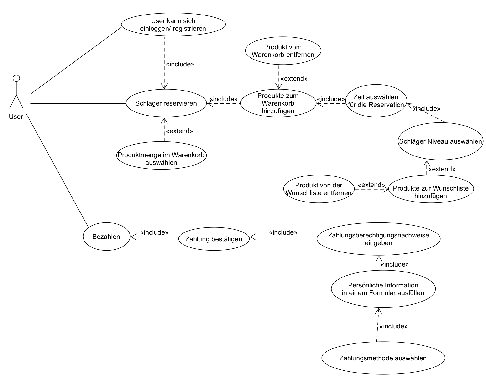
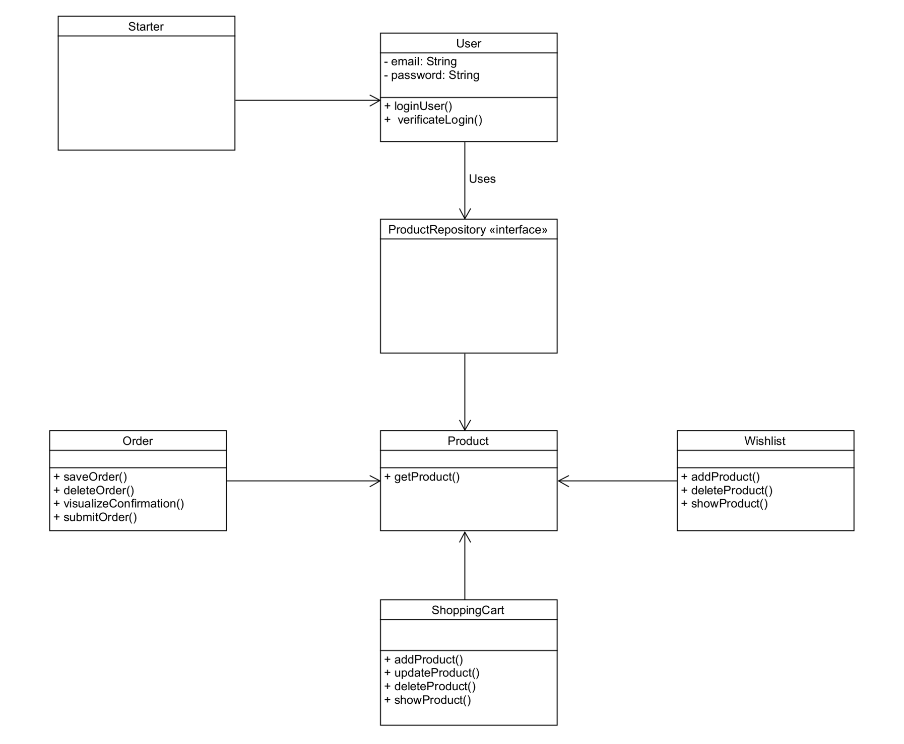

# Ping Pong Schläger-Reservation

Mit diesem Tool kann sich der Benutzer beim Reservierungstool anmelden oder registrieren und einen oder mehrere Tischtennisschläger reservieren. Das Tool bietet dem Benutzer weitere Funktionen, wie z. B. die Auswahl, welches Niveau, wie viele Schläger, ob mit oder ohne Tischtennisbälle und für wie lange.

#Demovorschau

# Inhalt
1. [Beschreibung](#beschreibung)
2. [Use cases](#usecase)
   1. [Fully dressed use cases](#fullyDressedUsecases)
   2. [Use case Diagramm](#useCaseDiagramm)
3. [Diagram](#Diagram)
    1. [Klassendiagramm](#klassendiagramm)
    2. [Ablaufdiagramm](#ablaufdiagramm)
4. [Usability-Test](#usability-test)
5. [Wireframe](#wireframe)
6. [Schlusswort](#schlusswort)

## Beschreibung 
Mit diesem Tool kann sich der Benutzer beim Reservierungstool anmelden oder registrieren und einen oder mehrere Tischtennisschläger reservieren. Das Tool bietet dem Benutzer weitere Funktionen, wie z. B. die Auswahl, welches Niveau, wie viele Schläger, ob mit oder ohne Tischtennisbälle und für wie lange.

## Use cases 
### Fully dressed use cases 
Screenshot from Fully dressed use cases to be added 
### Use case Diagramm 

## Diagram 

### Klassendiagramm 

## Usability-Test 

### Was möchten wir testen?
Wir möchten testen, wie benutzerfreundlich unsere Applikation ist.
Die Applikation ist so entworfen, dass sie einen Tischtennisschläger für eine bestimmte Zeit reservieren können. Nun wollen wir den Usability-Test überprüfen, indem wir zwei verschiedene Szenarien wie folgt durchspielen:

### Das erste Test-Szenario
Das Wetter ist am Samstag sehr schön und Sie möchten Tischtennis-Schläger für einen ganzen Tag reservieren. Da Ihr Niveau Anfänger und das Ihrer Freunde Profi sind, müssen Sie zwei Tischtennis-Schläger reservieren, aber mit zwei verschiedenen Niveaus.

#### Anweisung für das erste Szenario
1. Nehmen wir an, Sie haben bereits ein Konto erstellt, melden Sie sich an.
2. Klicken Sie auf "Start Reservation".
3. Sie werden auf die nächste Seite weitergeleitet und klicken nun auf "Check Availability".
4. Jetzt können Sie zum Warenkorb hinzufügen, wenn Sie es mögen und es verfügbar ist.
5. Um ein anderes Level zu wählen, klicken Sie auf den Navigationslink "Level".
6. Wiederholen Sie die Schritte 1, 2, 3 und 4 für den zweiten Schläger mit einem anderen Level.

#### Feedback von Person 1 für das erste Szenario

| Thema | Testergebnis | Verbesserungspotenzial |
| ----------- | ----------- | ----------- |
| Login | ok | - |
| Level auswählen | ok  | - |
| Datum auswählen | ok | - |
| Einen oder mehrere Schläger zum Warenkorb hinzufügen | ok | - |
| Bezahlen | ok  | - |

### Das zweite Test-Szenario
Sie haben sich erfolgreich für die Tischtennisschläger entschieden, die Sie reservieren wollten, aber Sie stellen gerade fest, dass Sie eine Änderung zu Ihrer Reservierung mitbringen sollten. Sie sollten die Verfügbarkeit prüfen, ob es möglich ist, sie an zwei Tagen hintereinander zu reservieren.

#### Anweisung für das zweite Szenario

1. Navigieren Sie zur Level-Seite.
2. Klicken Sie auf eine der Levels.
3. Um die Verfügbarkeit zu sehen, klicken Sie auf "Check Availability".
4. Wenn es ein passendes Datum für Sie gibt, dass zwei Tage in Folge bietet, wählen Sie das Datum aus und klicken Sie auf Add to shopping cart.

#### Feedback von Person 2 für das zweite Szenario

| Thema | Testergebnis | Verbesserungspotenzial |
| ----------- | ----------- | ----------- |
| Login | ok | - |
| Level auswählen | ok  | - |
| Datum auswählen | nicht ok | Es war nicht sehr benutzerfreundlich, das Verfügbarkeitsdatum zu prüfen. Nach Erhalt des Feedbacks werden nun die verfügbaren Daten mit grün hervorgehobenen Zellen und nicht verfügbare Daten mit rot hervorgehobenen Zellen angezeigt. |
| Einen oder mehrere Schläger zum Warenkorb hinzufügen | ok | - |
| Bezahlen | ok  | - |

## Wireframe
[Wireframe](https://pip.pypa.io/en/stable/) for Ping Pong reservation tool.

